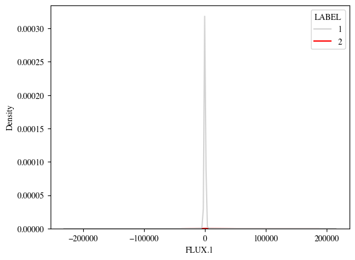

# Exoplanet-Star-Classification
In this project, we will analyse the flux data from thousands of stars via deep learning methods in order to classify them as either exoplanet-hosting stars or non-exoplanet-hosting stars. We will train one model on the training dataset in order to make predictions on the test dataset.

An exoplanet, or extrasolar planet, is the one that orbits a star outside our solar system. They give us information of the formation, composition, and diversity of planetary systems beyond the Solar system and they can vary in size, composition and orbital characteristics. Some of the types are terrestrial, super-earths, gas giants or neptune-like exoplanets.

## Table of Contents

- [Setup](#setup)
- [The Data: Star Light Intensities vs Time](#the-data-star-light-intensities-vs-time)
   - [Data Visualization](#data-visualization)
   - [Data Analysis](#data-analysis)
- [References](#references)

## Setup 
Below, we provide instructions for setting up this repository on a local machine and in Google Colab (to open the Notebook Exoplanet_Detection.ipynb).

### Getting started on a local machine
1. Open terminal and install git
   
   <pre><code>$ sudo apt install git</code></pre>
2. Clone the repository in a your own directory
   
   <pre><code>$ git clone https://github.com/anabr4/Exoplanet-Star-Classification.git</code></pre>
3. Enter the directory
   
   <pre><code>$ cd Exoplanet-Star-Classification/</code></pre>
4. Create a virtual environment with all the libraries that are needed to run the python scripts. You can create a virtual environment using Anaconda: 
     i. Install anaconda3 [https://docs.anaconda.com/anaconda/install/](https://docs.anaconda.com/anaconda/install/.) 
     ii. Create a virtual environment executing the following line:
   
     <pre><code>$ conda create -n exo_env python=3.11.13 anaconda </code></pre>
     iii. Activate it
   
     <pre><code>$ conda activate exo_env </code></pre>

     iv. Install the requirements (all necessary libraries).
   
     <pre><code>$ pip install -r requirements.txt </code></pre>
   

### Getting started in Colab
1. Head to Drive and open a new Colab file.
2. Click on File → click on Open notebook → Select 'GitHub' → paste the link to Exoplanet_Detection.ipynb → ENTER → click on the file Exoplanet_Detection.ipynb.
3. Download and add data folder to the folder in which you have saved the notebook.
4. In the Google Colab toolbar select: Runtime → Change Runtime. This will open another popup where you should ensure the runtime type is Python 3 and the hardware accelerator is CPU or GPU.
   
You're all set for executing the code.

## The Data: Star Light Intensities vs Time
The [data](https://www.kaggle.com/keplersmachines/kepler-labelled-time-series-data) has been cleaned and obtained from observations made by the NASA Kepler space telescope. It describe the change in flux (light intensity)(units not mentioned) of several thousand stars, with binary label 2 or 1, indicating the presence of at least one exoplanet in orbit or its absence, respectively. The transit method, used in this dataset, is an indirect method for detecting exoplanets, which consists in observing periodic dimming of a star's light intensity as a planet passes in front of it, as shown in the picture below.

(credit: NASA Ames)

Even if stars exhibit dimming in their intensity period, further study is required to confirm its existence, e.g. employing satellites capturing different wavelengths that provide additional data to ensure the results obteined with the transit method. 
The data presented here are cleaned and are derived from observations made by the NASA Kepler space telescope. Over 99% of this dataset originates from Campaign 3. To boost the number of exoplanet-stars in the dataset, confirmed exoplanets from other campaigns were also included.  Data provided is already divided into Training and Testing data.

The training data describe the change in flux of 5087 stars (observations) for 3197 time points (columns 2 to 3198) plus their label (column 1), which are the features and target. On the other hand, the test data describe the change in flux of 570 stars for the same features and target. Furthermore:
*   in training data there are 37 confirmed exoplanet-stars and 5050 non-exoplanet-stars.
*   in testing data there are 5 confirmed exoplanet-stars and 565 non-exoplanet-stars.

### Data Visualization
Executing the data_visualization.py file we obtain the fluxes of six different star, the first three which are labelled as 2 (confirmed at least one exoplanet-hosting star) and the latter three as 1 (non-exoplanet-hosting star). This script load the data stored in the data folder and run through the Train dataset plotting each flux value with respect to its time instant, selecting three stars which are labelled as 2 and three as 1.<be>
We can run it in our virtual environment doing:
<pre><code> $ python data_visualization.py </code></pre>
The flux spectra obtained for these six stars are the following:

We already see that some of the stars that are clasified with 2 do not have a very clear flux spectrum.

### Data Analysis
Now we will observe the relationship between variables.

With Pair plots we can see the correlation between different features, exectuting 
<pre><code> $ python data_analysis.py </code></pre>
We will plot these relationships for the first 5 flux values, then we will search for the outliers that are seen in them, remove them and show the Pair Plots again.

We obtain three plots, the first one:

They show that the first 5 light intensities are almost linear for fluxes near in time (in fact when we compare the first flux value with the fifth of them we see that linearity is lost), which means that the flux measured in one instant of one star is correlated to the subsequent flux of that star and between different stars in those time instants. However, there are some values quite separated from the rest, in fact, it seems that one star in each pairplot has a flux actually separated from the rate, which means that we have at least one outlier.

After removing them with the Standard Deviation method, in which, the number of $\sigma$ that has been chosen analysing non-exoplanet-hosting stars with spectra clearly noisy, we obtain the following plots:

And a Kernel Density Estimate Plot of Flux 1 to estimate the probability distribution of this continuous variable. We can see that the distribution for label 2 (exoplanet-hosting-star) is highly under-represented.

## References
[1] Priyadarshini, I., & Puri, V. (2021). A convolutional neural network (CNN) based ensemble model for exoplanet detection. Earth Science Informatics, 14(2), 735-747. 
[2] Chawla, N. V., Bowyer, K. W., Hall, L. O., & Kegelmeyer, W. P. (2002). SMOTE: synthetic minority over-sampling technique. Journal of artificial intelligence research, 16, 321-357. 
[3] Chintarungruangchai, P., & Jiang, G. (2019). Detecting exoplanet transits through machine-learning techniques with convolutional neural networks. Publications of the Astronomical Society of the Pacific, 131(1000), 064502. 
[4] Outlier Detection Methods. [https://www.kaggle.com/code/marcinrutecki/outlier-detection-methods](https://www.kaggle.com/code/marcinrutecki/outlier-detection-methods)
