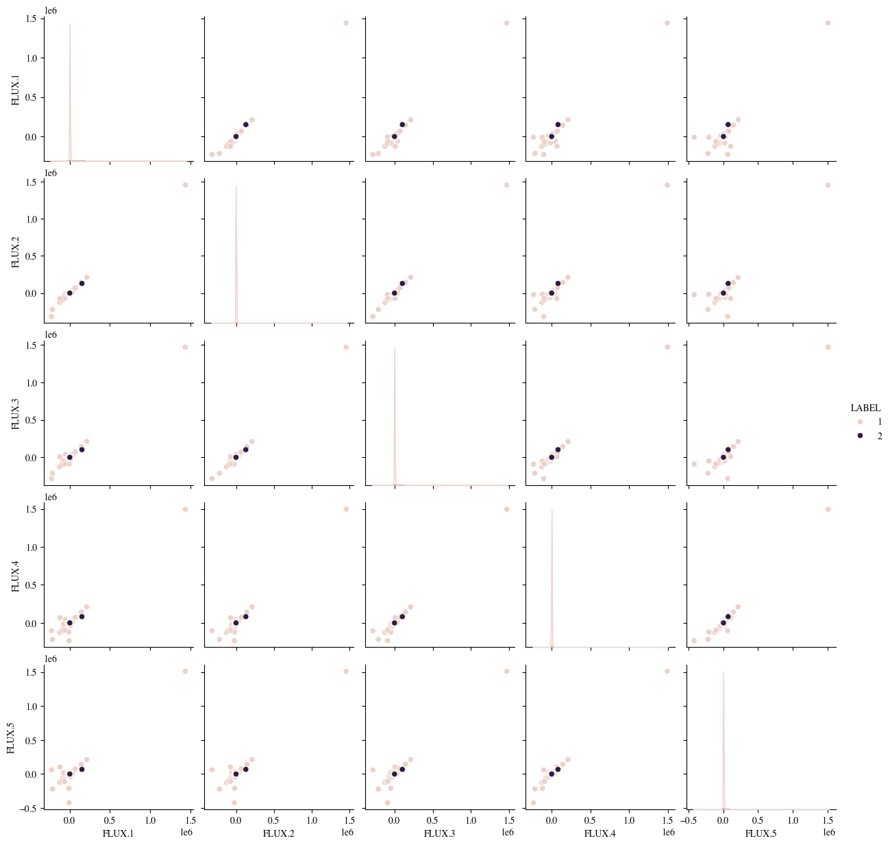

# Exoplanet-Star-Classification
In this project, we will analyse the flux data from thousands of stars via deep learning methods in order to classify them as either exoplanet-hosting stars or non-exoplanet-hosting stars. We will train one model on the training dataset in order to make predictions on the test dataset.

An exoplanet, or extrasolar planet, is the one that orbits a star outside our solar system. They give us information of the formation, composition, and diversity of planetary systems beyond the Solar system and they can vary in size, composition and orbital characteristics. Some of the types are terrestrial, super-earths, gas giants or neptune-like exoplanets.

## Table of Contents

- [Setup](#setup)
- [The Data: Star Light Intensities vs Time](#the-data-star-light-intensities-vs-time)
   - [Data Visualization](#data-visualization)
   - [Data Analysis](#data-analysis)
- [Data Pre-Processing](#data-pre-processing)
- [CNN Model](#cnn-model)
- [When you are done](#when-you-are-done)
- [Conclusion](#conclusion)
- [References](#references)

## Setup 
Below, we provide instructions for setting up this repository on a local machine and in Google Colab (to open the Notebook Exoplanet_Detection.ipynb).

### Getting started on a local machine
1. Open terminal and install git
   
   <pre><code>$ sudo apt install git</code></pre>
2. Clone the repository in a your own directory
   
   <pre><code>$ git clone https://github.com/anabr4/Exoplanet-Star-Classification.git</code></pre>
3. Enter the directory
   
   <pre><code>$ cd Exoplanet-Star-Classification/</code></pre>
4. Create a virtual environment with all the libraries that are needed to run the python scripts. You can create a virtual environment using Anaconda: 
     i. Install anaconda3 [https://docs.anaconda.com/anaconda/install/](https://docs.anaconda.com/anaconda/install/.) 
     ii. Create a virtual environment executing the following line:
   
     <pre><code>$ conda create -n exo_env python=3.11.13 anaconda </code></pre>
     iii. Activate it
   
     <pre><code>$ conda activate exo_env </code></pre>

     iv. Install the requirements (all necessary libraries).
   
     <pre><code>$ pip install -r requirements.txt </code></pre>
   

### Getting started in Colab
1. Head to Drive and open a new Colab file.
2. Click on File → click on Open notebook → Select 'GitHub' → paste the link to Exoplanet_Detection.ipynb → ENTER → click on the file Exoplanet_Detection.ipynb.
3. Download and add data folder to the folder in which you have saved the notebook.
4. In the Google Colab toolbar select: Runtime → Change Runtime. This will open another popup where you should ensure the runtime type is Python 3 and the hardware accelerator is CPU or GPU.
   
You're all set for executing the code.

## The Data: Star Light Intensities vs Time
The [data](https://www.kaggle.com/keplersmachines/kepler-labelled-time-series-data) has been cleaned and obtained from observations made by the NASA Kepler space telescope. It describe the change in flux (light intensity)(units not mentioned) of several thousand stars, with binary label 2 or 1, indicating the presence of at least one exoplanet in orbit or its absence, respectively. The transit method, used in this dataset, is an indirect method for detecting exoplanets, which consists in observing periodic dimming of a star's light intensity as a planet passes in front of it, as shown in the picture below.

(credit: NASA Ames)

Even if stars exhibit dimming in their intensity period, further study is required to confirm its existence, e.g. employing satellites capturing different wavelengths that provide additional data to ensure the results obteined with the transit method. 
The data presented here are cleaned and are derived from observations made by the NASA Kepler space telescope. Over 99% of this dataset originates from Campaign 3. To boost the number of exoplanet-stars in the dataset, confirmed exoplanets from other campaigns were also included.  Data provided is already divided into Training and Testing data.

The training data describe the change in flux of 5087 stars (observations) for 3197 time points (columns 2 to 3198) plus their label (column 1), which are the features and target. On the other hand, the test data describe the change in flux of 570 stars for the same features and target. Furthermore:
*   in training data there are 37 confirmed exoplanet-stars and 5050 non-exoplanet-stars.
*   in testing data there are 5 confirmed exoplanet-stars and 565 non-exoplanet-stars.

### Data Visualization
Executing the data_visualization.py file we obtain the fluxes of six different star, the first three which are labelled as 2 (confirmed at least one exoplanet-hosting star) and the latter three as 1 (non-exoplanet-hosting star). This script load the data stored in the data folder and run through the Train dataset plotting each flux value with respect to its time instant, selecting three stars which are labelled as 2 and three as 1. It also shows the number of stars labelled with 1 and with 2, respectively, and the shape of both datasets, as shown above.<be>
We can run it in our virtual environment doing:
<pre><code> $ python data_visualization.py </code></pre>
The flux spectra obtained for these six stars are the following:

We already see that some of the stars that are clasified with 2 do not have a very clear flux spectrum.

### Data Analysis
Now we will observe the relationship between variables.

With Pair plots we can see the correlation between different features, exectuting 
<pre><code> $ python data_analysis.py </code></pre>
We will plot these relationships for the first 5 flux values, then, we will search for the outliers that are seen in them, print the number of stars with at least one outlier that passes the condition we have imposed and remove them. Furthermore we will show the Pair Plots again. All plots will be saved in 'plots' folder.

We obtain three plots, the first one:

They show that the first 5 light intensities are almost linear for fluxes near in time (in fact when we compare the first flux value with the fifth of them we see that linearity is lost), which means that the flux measured in one instant of one star is correlated to the subsequent flux of that star and between different stars in those time instants. However, there are some values quite separated from the rest, in fact, it seems that one non-exoplanet-hosting star in each pairplot has a flux actually separated from the rest, which means that we have at least one outlier.

After removing them with the Standard Deviation method [4], in which the number of $\sigma$ has been chosen analysing non-exoplanet-hosting stars with spectra clearly noisy, we obtain the following plots:

And a Kernel Density Estimate Plot of Flux 1 to estimate the probability distribution of this continuous variable. We can see that the distribution for both labels are highly imbalanced, as label 2 (exoplanet-hosting-star) is almost not seen in the plot, so we will try to handle this problem later.

## Data Pre-Processing
We have already seen one of the aspects to adress, outliers, so first, we will remove them also from the train dataset. Another thing to adress is to treat missing values but there aren't, so we should have accurate prediction models.

Neural networks tend to perform best when their inputs are on a common scale. So, other thing that we should consider is scaling the data on a common scale before introducing it to the DL model, however, we have seen that flux spectra worsen if we perform the Standard Scaling and a Gaussian filter [5], to smooth the spectra, on training data, and it is more difficult to distinguish between the flux of a star which has an exoplanet orbiting and one which hasn't, visually. We also performed the scaling, after pre-processing data, and trained the model, but we also obtained worse results.

Other thing that we should do before training our model with data is changing the values of the labels to 0 and 1 as convention:
- 1 --> 0
- 2 --> 1

We have seen that Train and Test datasets present a class imbalanced of the order 100 to 1, so probably we could achieve a high accuracy on classifying non-exoplanet stars but we would find difficulties to have a high rate of correct detection of the minority class (in our case exoplanet stars). 
We propose an over-sampling approach in which the minority class is over-sampled by creating “synthetic” examples (synthetic minority over-sampling technique [2]) rather than by over-sampling with replacement. 
The majority class is under-sampled by randomly removing samples from the majority class population until the minority class becomes some specified percentage of the majority class.

Executing the followiing script:
<pre><code> $ python data_preprocessing.py </code></pre>
We print the number of missing values (zero), we save the plot of the flux spectra, after applying data filtering and smoothing, in 'plots' folder and we save the pickle file with x_train, y_train, x_test and y_test (to ensure that it is mantained the data structure of x and y in train and test datasets) in 'data' folder. 

As we have mentioned, light flux spectra after applying Standard Scaling and a Gaussian filter is:

## CNN Model
Finally, after obtaining processed training data, we can proceed to train our proposed model, a Convolutional Neural Network, which was chosen because of its local connectivity property, which means that neurons in one layer are only connected to neurons in the next layer that are spatially close to them. This design reduce the vast majority of connections between consecutive layers, but keeps the ones that carry the most useful information. The assumption made here is that the input data has spatial significance. In our case, the star light spectra are continuous time-dependent functions, so each point of the spectra function is related to its neighbours. 
It consists of the following layer architecture:
* Normalization Layer: after introducing features in the input layer (reshaping it to adjust it to the network), this layer applies a feature-wise normalization to the input data, converting the mean to 0 and the standard deviation to 1.
* Convolutional 1D Layers: used to detect patterns in our time series applying several filters taking information from 2 (kernel size equal to 2) consecutive values each time. The activation function used in these layers is the Rectified linear unit (ReLU). A L2 regularization is also applied, which takes an upper bound of incoming weight vector for each individual hidden unit, which prevents weights from growing too much. As we go deeper in the network these layers are able to detect more complex patterns.
* Batch Normalization Layers: applied after Conv1D Layer to normalize the outputs and improve the stability.
* MaxPooling1D Layer: its combination with Conv1D Layers can reduce the length of the sequence, mantaining the most relevant characteristics (features) while reducing computational complexity.
* Dropout Layers: important to correct overfitting. It drops out a 0.4 or 0.3 (depending on the previous layer) fraction of layer's input unit every step of training, so it makes it difficult to learn spurious patterns and helps to search broad and general ones.
* Flatten Layer: flattens the input tensor into a 1D vector, in order to prepare the data for the fully connected layers.
* Dense Layers: fully connected layers with ReLU activation function and different unit dimensions, progressively reducing the dimensions of the network.
* Output Layer: one unit dense layer with Sigmoid activation function, to convert thee output in a probability (between 0 and 1) of the possitive class based on the input, making the model suitable for a binary classification problem. We set a different threshold (from 0.5) to classify between 0 and 1, based on the maximization of F1 score.

For optimization of our network, the Adam optimizer was used, specifying its learning rate thanks to the Exponential Decay function (which takes an initial rate and reduce it in steps in order to learn with higher precision when the model is getting near to a good solution. 
Early stopping was also used to stop training when it reaches a point of no further improvement and avoid overfitting (when validation loss stops decreasing and starts to rise again).

In order to validate our model, we performed predictions on test data and plotted the confusion matrix, showing also the F1 score (harmonic mean of precision and recall metrics) and the area under the Receiver Operating Characteristic (ROC) curve. We chose a validation split of 0.2 to make the model able to correctly learn from the remaining data and have the best validation possible without increasing too much computing resources. As we have seen data is highly imbalanced and even if we performed oversampling, the validation evolution during epoch was not very stable as we can see below in the training evolution plot.

To train the model and obtain predictions, we can simply execute the following script:
<pre><code> $ python cnn_classifier.py </code></pre>
Which returns the confusion matrix computed with predictions performed with validation and test data, the evolution of model training, evaluating loss and validation loss and recall and validation recall, and finally all computed metrics.

Model training evolution is shown in the following plot, and even if validation was not actually stable with the data we have, we obtained improvable but good classification results on test data.

After training the model, we obtained a F1 score of 0.8880 and a ROC AUC of 0.9984 from test dataset predictions and the following confusion matrix:

## When you are done
1. Deactivate the virtual environment

   <pre><code> $ conda deactivate </code></pre>

2. Remove the environment

   <pre><code> $ conda env remove -n exo_env</code></pre>

3. Delete the project folder, inside the Exoplanet Star Classification folder, run:

   <pre><code> $ rm -fr .git 
    $ cd ..
    $ rm -r Exoplanet-Star-Classification</code></pre>

## Conclusion

## References
[1] Priyadarshini, I., & Puri, V. (2021). A convolutional neural network (CNN) based ensemble model for exoplanet detection. Earth Science Informatics, 14(2), 735-747. 
[2] Chawla, N. V., Bowyer, K. W., Hall, L. O., & Kegelmeyer, W. P. (2002). SMOTE: synthetic minority over-sampling technique. Journal of artificial intelligence research, 16, 321-357. 
[3] Chintarungruangchai, P., & Jiang, G. (2019). Detecting exoplanet transits through machine-learning techniques with convolutional neural networks. Publications of the Astronomical Society of the Pacific, 131(1000), 064502. 
[4] Outlier Detection Methods. [https://www.kaggle.com/code/marcinrutecki/outlier-detection-methods](https://www.kaggle.com/code/marcinrutecki/outlier-detection-methods) 
[5] Mathur, S., Sizon, S., & Goel, N. (2020). Identifying exoplanets using deep learning and predicting their likelihood of habitability. In Advances in Machine Learning and Computational Intelligence: Proceedings of ICMLCI 2019 (pp. 369-379). Singapore: Springer Singapore.
